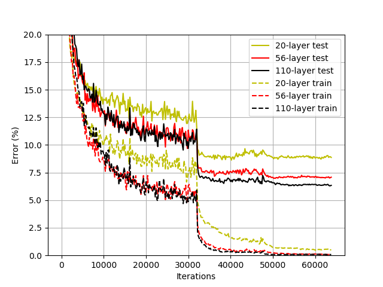
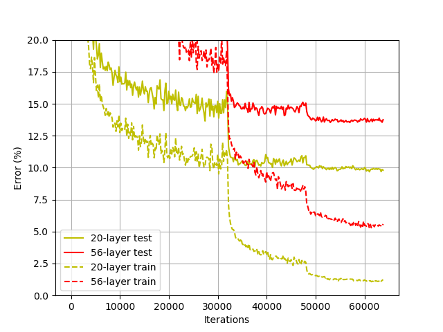
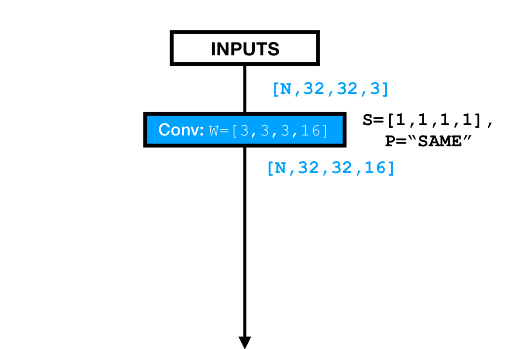
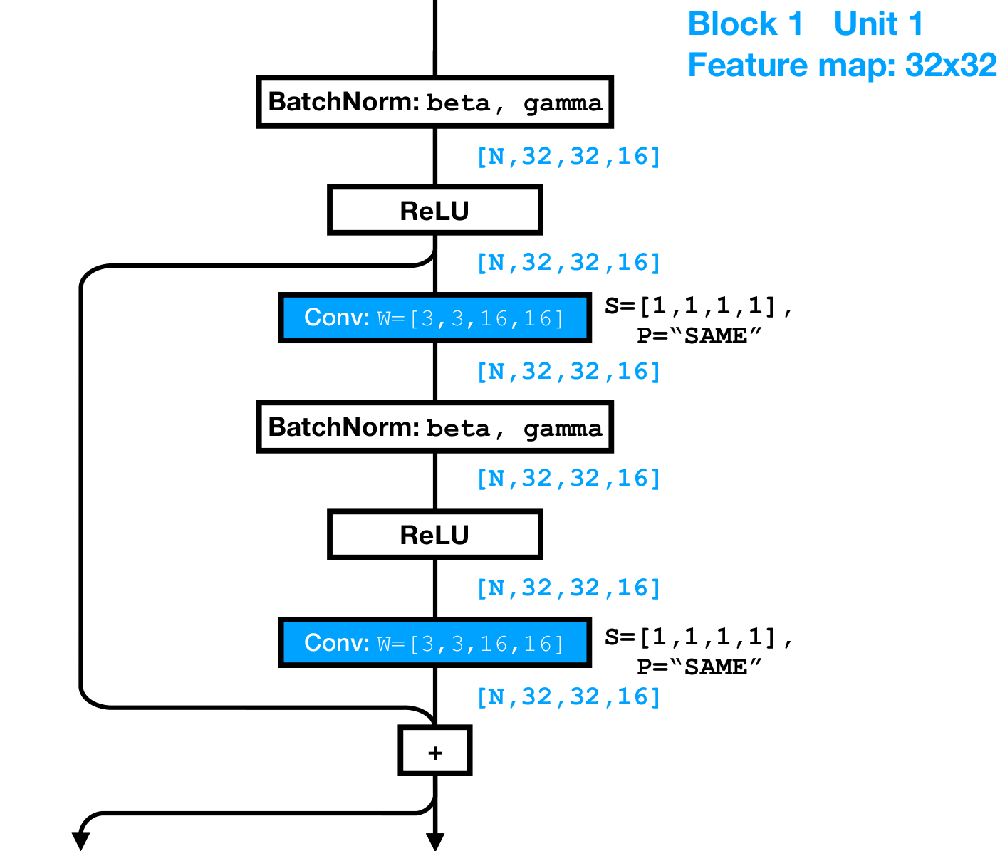
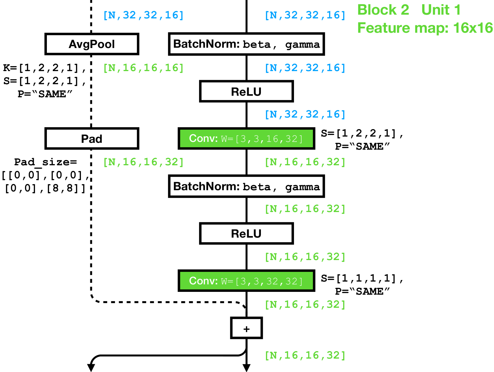
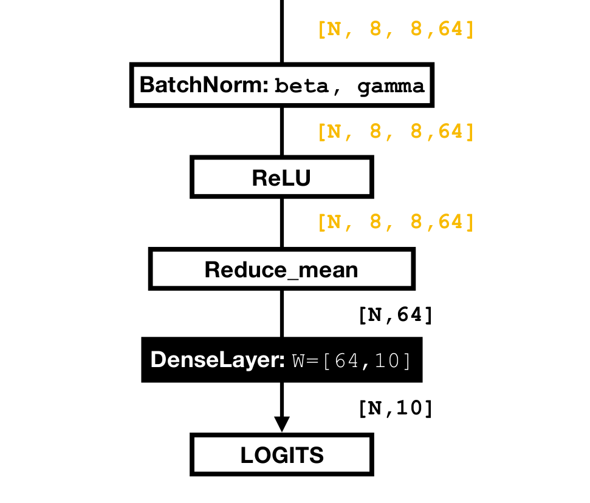

# ResNet: Classifying CIFAR-10 images 

**Note**: the **v2** directory contains implementation fully compatible with TensorFlow 2.0.

* A lightweight TensorFlow implementation of ResNet model for classifying CIFAR-10 images. 

* Reproduces the results presented in the paper.

* Shows the full schematic diagram of a 20-layer ResNet annotated with feature map sizes.

### Usage
##### Clone the Repo
```
git clone git@github.com:chao-ji/tf-resnet-cifar10.git
```
##### Download and untar CIFAR-10 dataset
```
wget https://www.cs.toronto.edu/~kriz/cifar-10-binary.tar.gz
tar -xvzf cifar-10-binary.tar.gz
```
##### Train the ResNet Classifier
To train the ResNet model using default settings, simply run
```
python run_trainer.py \
  --path=cifar-10-batches-bin
```
To change the number of layers in the ResNet (for example, to 110), specify `--num_layers=110`. To degenerate the ResNet model to a *Plain network*, specify `--shortcut_connections=False`. To see a full list of arguments, run
```
python run_trainer.py --help
```
##### Evaluate a Trained ResNet Classifier
To evaluate the trained model on the test set (10,000 images), run
```
  python run_evaluator.py \
    --path=cifar-10-batches-bin \
    --ckpt_path=/PATH/TO/CKPT \
    --num_layers=110
```
Note that you need to specify the path to the checkpoint file containing trained weights via `--ckpt_path`.
### Results
We train three ResNets with the number of layers being 20, 56, and 110, and we evaluate their accuracy on the test set (10,000 images). As we can see, deeper version of ResNet achieves better accuracy compared with the shallower version, while the trend is opposite for the Plain network with no residual connections (c.f. Figure 6 in the ResNet paper).


##### Residual Net
<p align="center"></p>

##### Plain Net
<p align="center"></p>


### Build ResNet Model
Here we briefly discusses the nuts and bolts of building a ResNet model (i.e. the one for CIFAR10 dataset without the bottleneck structure). We use the convention of `[batch, height, width, depth]` to describe the shape of feature map. For example, the input to ResNet, i.e. the images has shape `[N, 32, 32, 3]`.

##### Initial Conv Layer
The ResNet model backbone starts with an initial conv layer with no bias. It simply increases the depth of the input feature map from 3 to 16 via a single conv op.
<p align="center"></p>

##### Blocks and Units
Then it stacks up three similarly structured *blocks*, which gradually halves the sizes of height and width, and doubles the depth dimension (i.e. from `[N, 32, 32, 16]` to `[N, 16, 16, 32]`). Each block has multiple repeating *units*, each of which contains two conv layers:
<p align="center"></p>

Note the conv layers in the repeating units are **preactivated** -- the batch-norm layer and nonlinearity (ReLU) *precedes* the conv layers as opposed to following them, which is used in *ResNet v2*. <sup>[1](#myfootnote2)</sup>

##### Shortcut Connection
There are a total of three blocks in this ResNet, and the feature map sizes (height and width dimension) are halved while the depth is doubled within the first unit of the following block. This would cause a shape mismatch if we were to naively add a shortcut connection linking the input (shape `[N, 32, 32, 16]`) and output (shape `[N, 16, 16, 32]`) feature maps of the first unit.

To ensure the two feature maps coming out of the backbone branch and shortcut branch are shape-compatible, we use the **Identity Shortcut** option described in the paper -- in the shortcut branch, we first average-pool the incoming feature map with `stride=2, kernel_size=2, pad='SAME'`, and then zero-pad the depth dimension, so that the two feature maps end up having the same shape `[N, 16, 16, 32]`. 

<p align="center"></p>

##### Global Pooling and Projection Layer
The backbone ends with a *global average pooling* (`Reduce_mean`), so that the height and width dimensions vanish (`[N, 8, 8, 64]` to `[N, 64]`). The final prediction logits is generated by projecting the 64-D representation of images (`[N, 64]`) into 10-D space.

<p align="center"></p>

The full diagram of a 20-layer ResNet can be found [here](./files/ResNet20_CIFAR10.pdf).

### References:
  1. <a name="myfootnote1">ResNet V1</a>, Deep Residual Learning for Image Recognition, He *et al.*
  2. <a name="myfootnote2">ResNet V2</a>, Identity Mappings in Deep Residual Networks, He *et al.*
